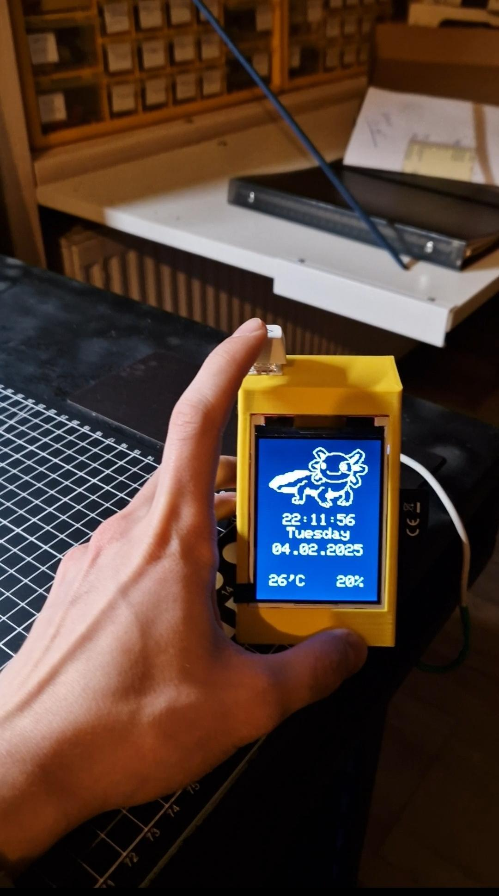
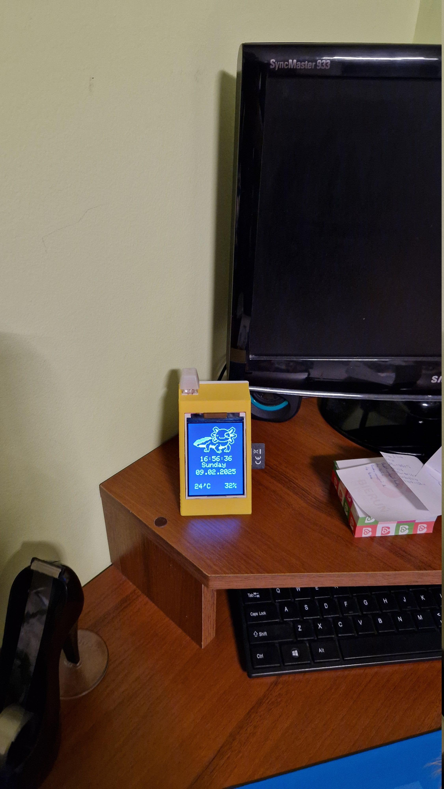
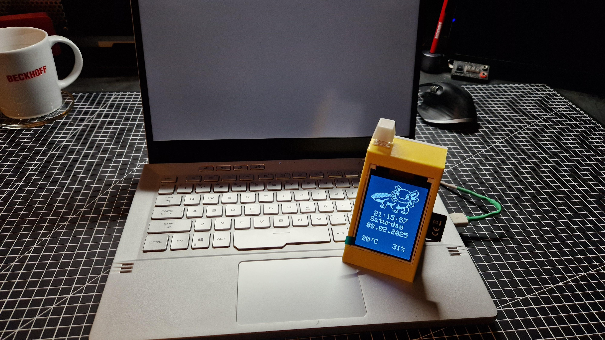
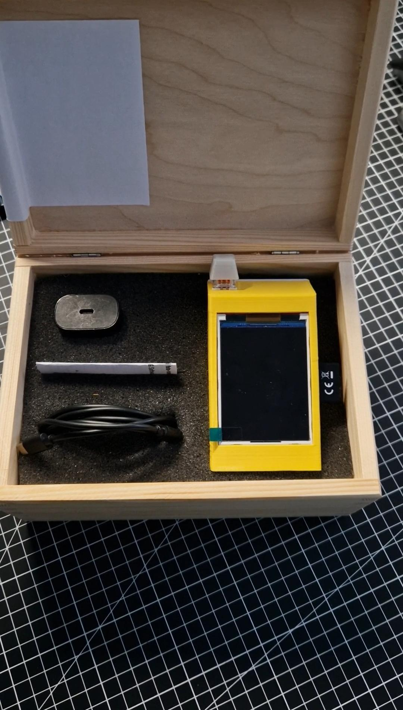

#
## Github Repo


#
# Quick story behind making this project
This photo-frame has been created as a gift for my girlfriend. I wanted to make something unique that will also be useful...ish and with the possibility to be updated. But after creating this, I figured out that It might be a good idea to also release all the files bc I know how much trouble I had with making a photo-frame based on arduino and wanted to maybe help others. So if you are reading this, bc you want to make your own photo-frame, you are in the right place.

#
# Making one for yourself
## Target device
This project has been designed for Raspberry Pi Pico W with ILI9341 display so keep in mind that this tutorial will focus on Pico W. But feel free to modify it to your own needs.

## Code
Make sure to download all the libraries needed for this project to work, I do this by compiling the code and then installing libraries that caused an error.

**Important** Don't download the DHT11 library from the library manager, copy files from `Code/library for dht11` from repo and paste it into your Arduino Libraries folder. Or you can modify the code to work with other libraries

After successfully installing all libraries, change:
- `ssid*` to your networks ID/Name
- `password*` to your networks password
- `totalPhotos` to number of photos you want to be displayed
After you have done all of that, you are ready to upload code to Pico W. You may need to change this code to display your local time, right now it is set to UTC and UTC+1.

## Wiring
- Connect your display to SPI0 of your Pico, you may follow [this](https://electronoobs.com/eng_arduino_tut58.php) tutorial from electronoobs about connecting ILI9341 to an arduino
- Connect SD card to SPI1 of Pico
- Connect DHT11's data pin to pin 5 of your Pico
- Connect your button to Pico's pin 9
- I gave also added a switch on ILI9341's LED line to be able to turn off the screen

## Creating bitmaps
This is an important step, you have to convert your photos to a 24 bit bitmap. I was using [gimp](https://www.gimp.org/). Here are some important things you have to remember:
- Set height to 320px
- Set width to 240px
- When exporting your photo to bitmap (.bmp) remember to export it as a 24 bit bitmap! Otherwise it won't work
- name your photos starting from 1, e.g. `1.bmp` and so on
Then upload all your photos to your SD card, on your SD card you should create a folder named `Photos`. That is the place for all your bitmaps.

## Case
If you wish, in the repo I have included files for the case I designed and 3D printed. You have `.stl` files and files for freecad if you want to edit something about them. Keep in mind that it may not suit you.

## Usage
When pluged in, you should see an Axolotl, current time, day of the week, date, temperature and humidity. This is the main menu screen. To see your photo press the button. Your photo will be displayed. To go back to main menu press the button again. If you wish to change time from winter to summer or summer to winter, hold down the button when in main menu for 2 seconds.

## Credits
- code for displaying bitmaps is based on [work of](https://forums.adafruit.com/viewtopic.php?t=141979) `Rarday` on adafruit forum but with slight modifications so it works
- getting time from webserver is based on [work of](https://github.com/tehniq3/NTPclock_RPi_Pico_W/blob/main/ntp_test_serial.ino) `tehniq3` on github
- dht11 library, sadly I couldn't find who made this library, but when I do, I will post it here to give appropriate credits. 

## Gallery

  
  
  
  


# Last words
I hope I have helped someone trying to make a Photo-frame themselves or someone just trying to display bitmap's on ILI9341. Whatever It is, I hope it goes well for you.
Thank you for reading this article.  

**Keep making awesome projects**   
**~Simon**

