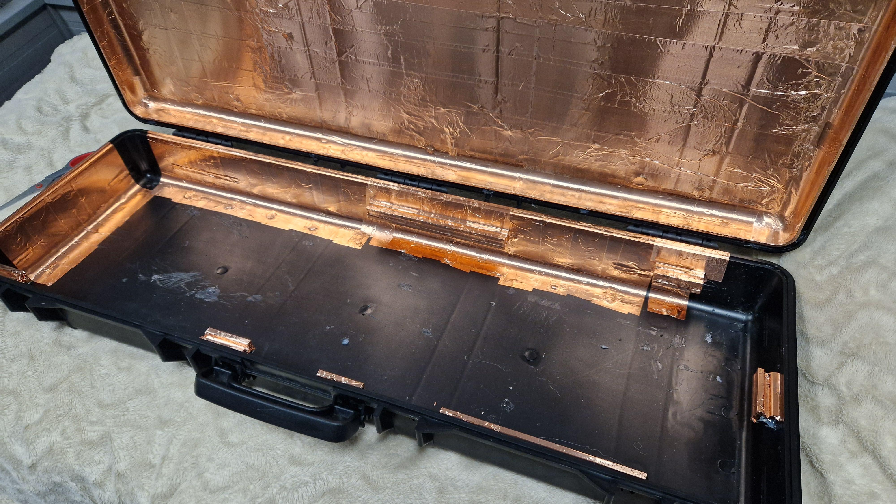
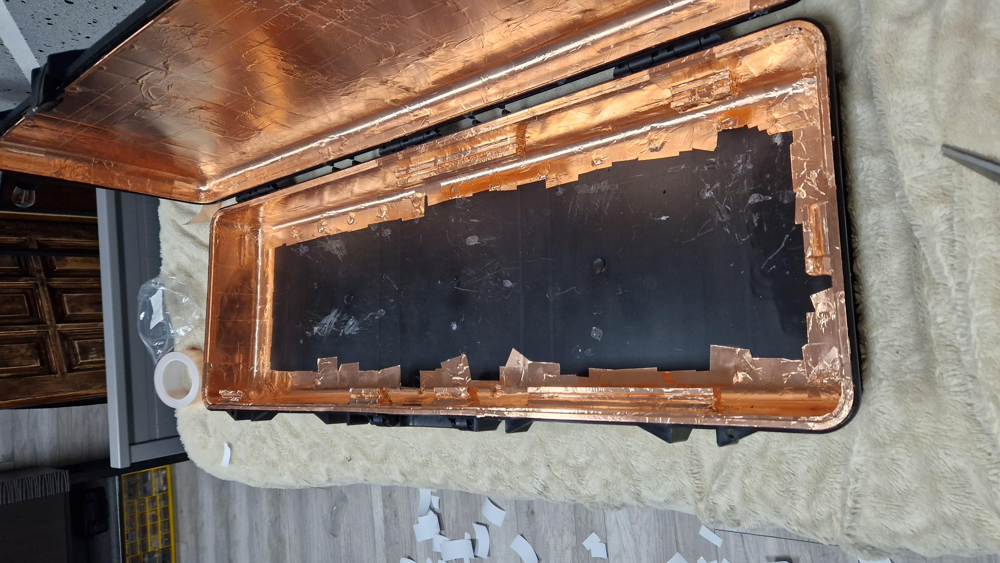
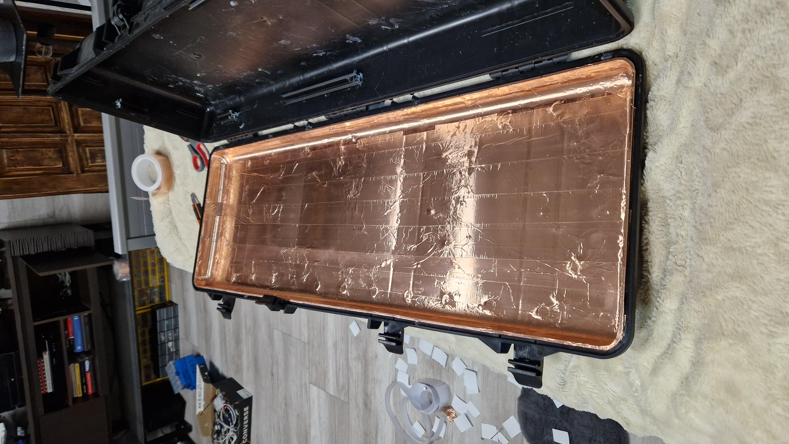
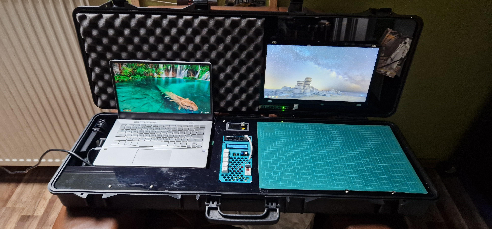
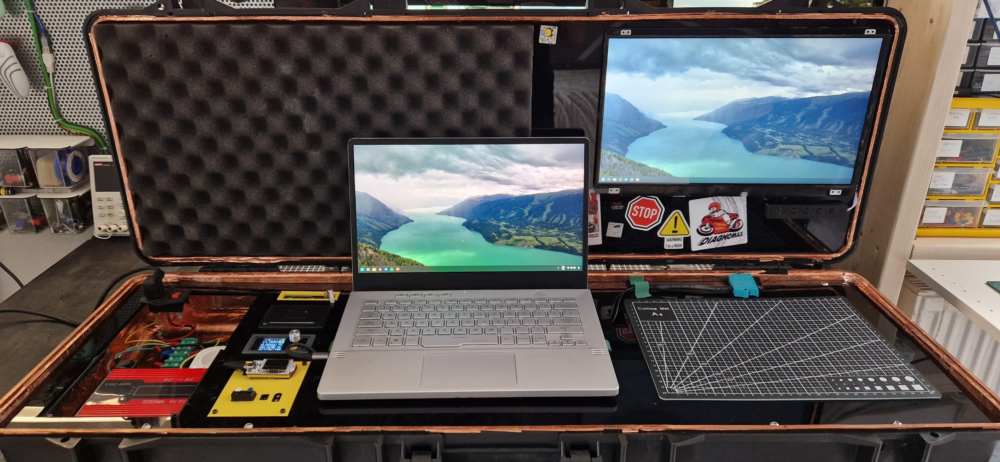
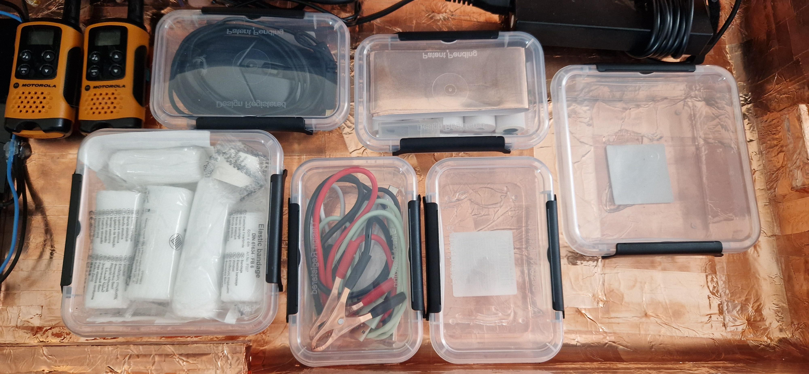
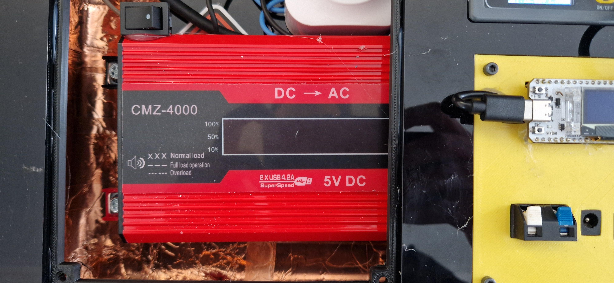
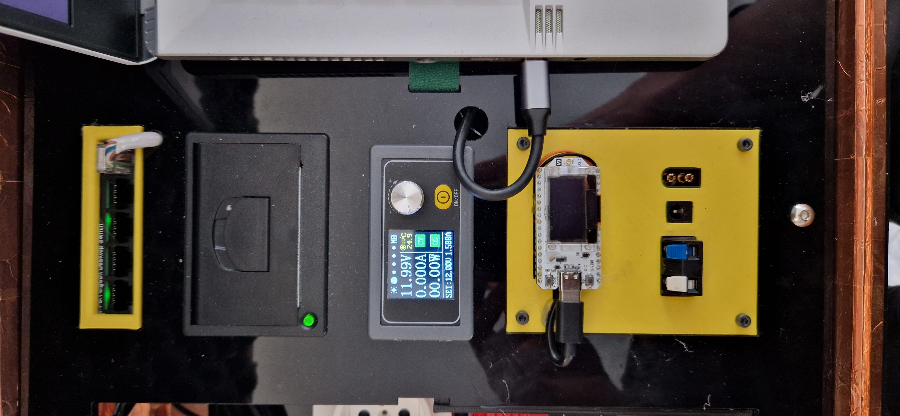

This is my largest project to date (more like a second version of it, first one was [cition portable mk1](/projects/Cition)) and I have learned a lot when creating it. As it turns out, making a portable workstation is not at all an easy task. So join me as I explain everything that went wrong.

## Improvements over Cition portable mk1
### EMP shielding
That's actually what I wanted to add to cition portable mk1. But this version is entirely covered in not cheap copper tape. I dont think it even works though... My success rate of blocking communication to devices stored inside is like 40%. As it turns out EMP shielding is pretty darn hard...

  
  
  
  


### Improved ergonomics
Cition mk1 was great but its ergonomics sucked... having the laptop and screen on the far corners of a suitcase wasn't a smart idea so this version has a laptop in the center and everything kinda built around it. This helps with using the second screen as well as allows for a better use of '*desk space*'. *Old one on the left and new one on the right*

  
  


### Smaller changes
There are a few smaller changes like:
- Added a 300W inverter to allow for power with just a 12V battery, just in case
- Changed power supplies. Previous version was using a giant PS from an old Ender 3, now It's using 2 separate power supplies, one for powering all devices and another one for powering the Lab Bench Power Supply module
- Thermal printer, I just like the idea of having a thermal printer integrated to be able to print stuff in this cool looking format
- HDD drive, bc all my backups from my main computer are made on a seperate HDD drive and I wanted to have an ability to connect it to my laptop
- Storage space. This point might be weird but mk1 didn't have any storage space so it's nice to have it now, especially bc it's a suitcase after all   


  
  
  
  


## The future of this project
Cition has a great potential and its ultimate test is going to be this year's (2025) hackathon. Until then I still have to finish one last cover, write code for the thermal printer and  make portable legs for it so I can use it anywhere. Stay tuned!

**Keep making dope projects**    
**~Simon**

