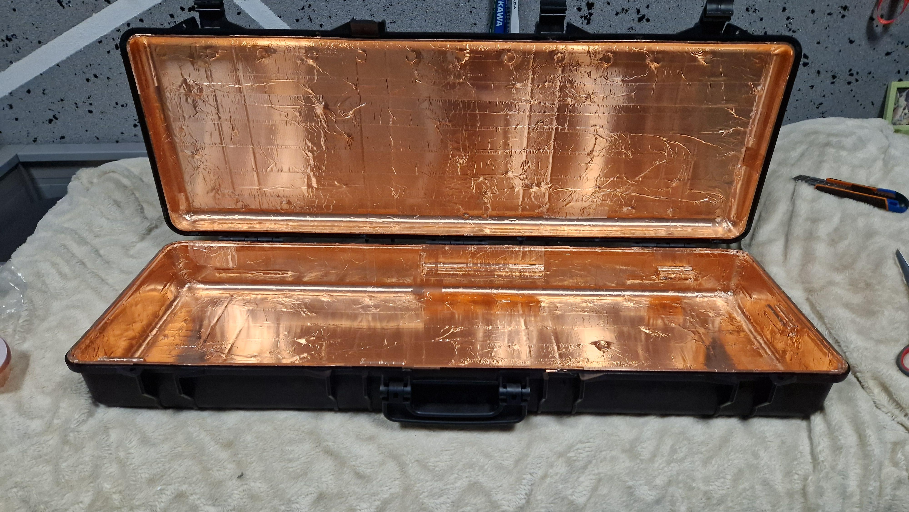
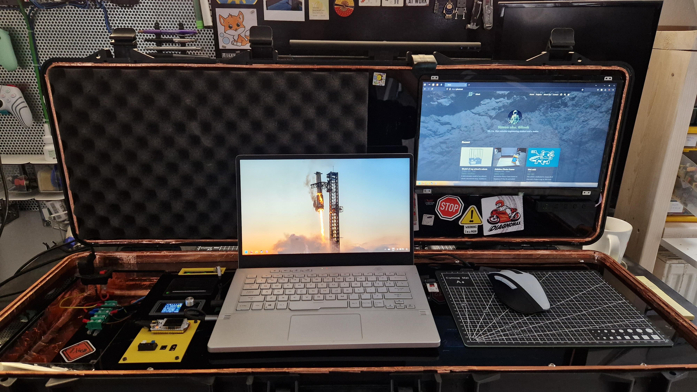
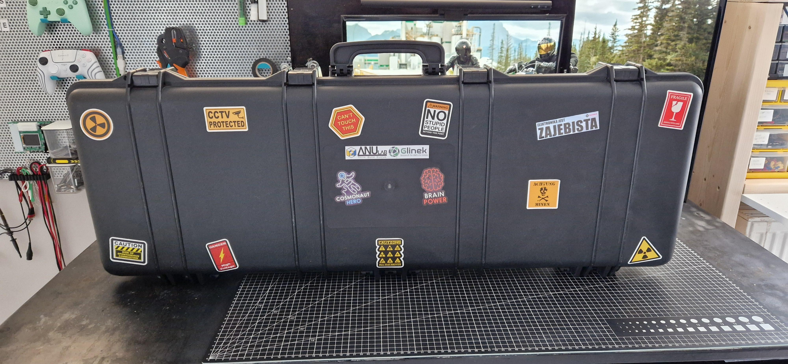
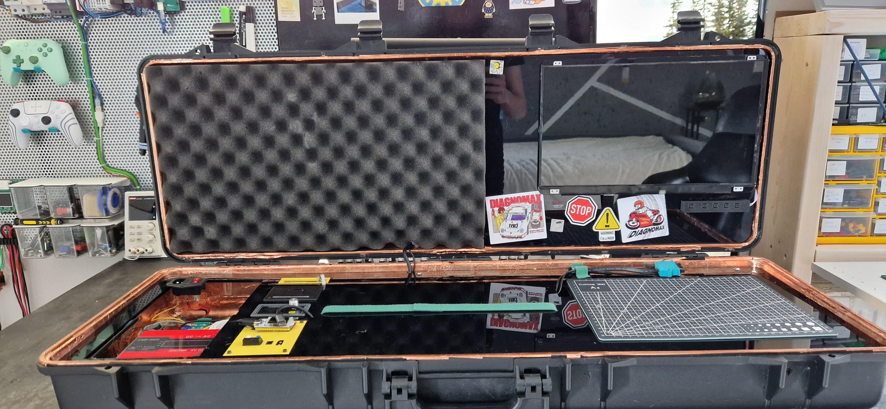
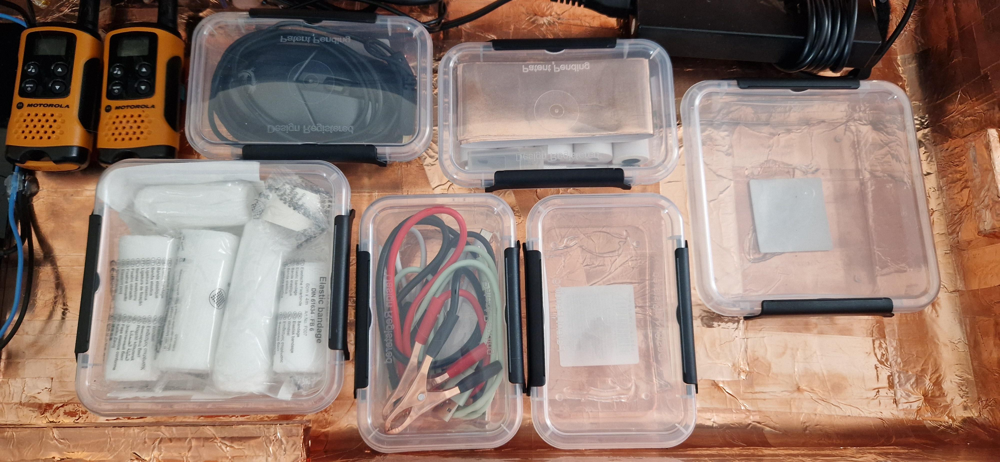
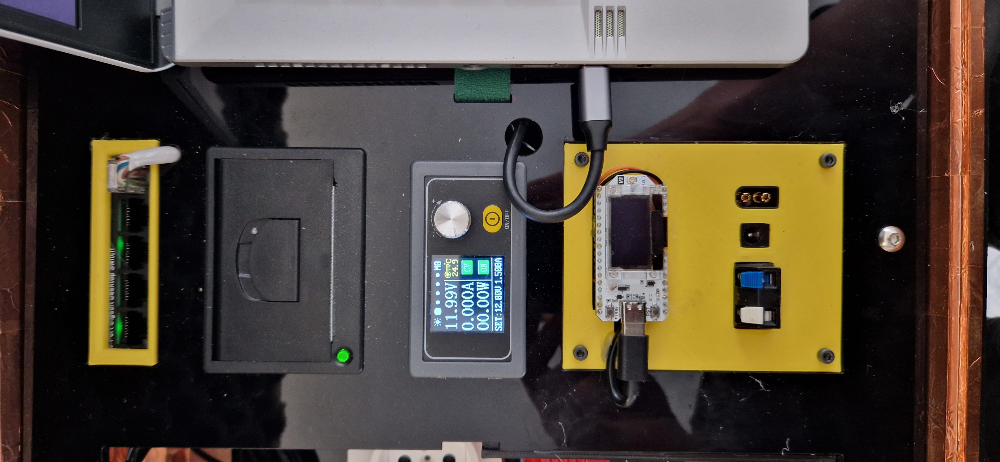
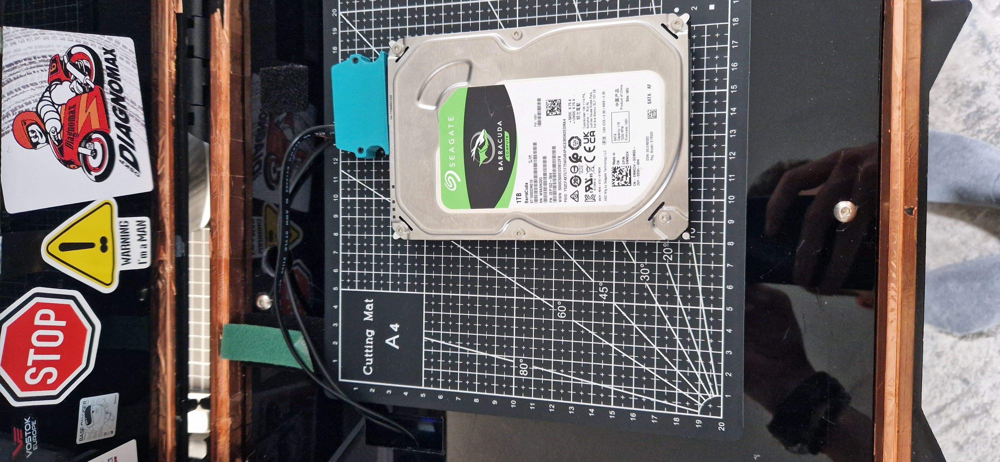

**
This page is in active development. Please visit later
**

## Improvements over previous version
There are a few improvements over PeliCase.mk1 (my short form bc 'Pelican Case workstation' is just too long), the major ones are:
- EMP shielding. I have covered the entire inside of a PeliCase in copper tape this makes it a SEMI-working faraday cage, it works like 50% of the time
- Improved ergonomics. The previous version had you sit on one side of a case and look to the other side if you wanted to use the built-in monitor. And that was to put it lightly a problem. Mk2 has it fixed, now you sit at the center which makes it much more comfortable to use.
- Integrated HDD. Another but not so major upgrade is an integrated SATA connector for full size HDD drives.

## Photos for you to enjoy!

  
  
  
  
  
  
  
  
  
  


**Keep making dope projects**    
**~Simon**