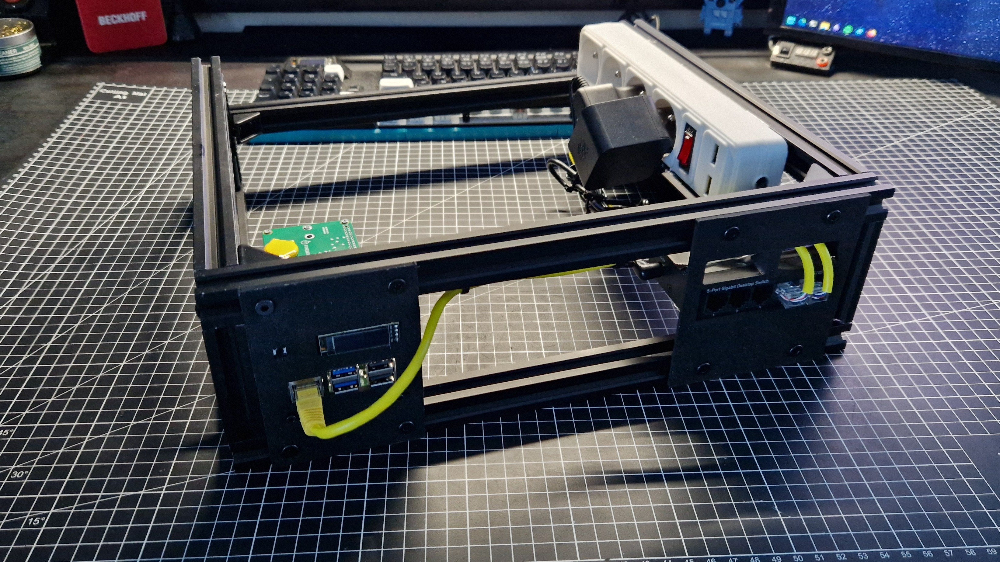
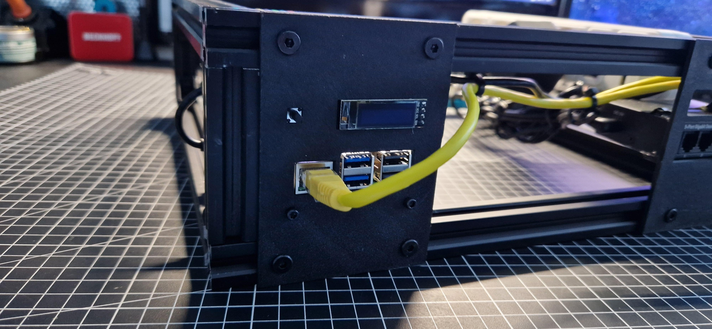
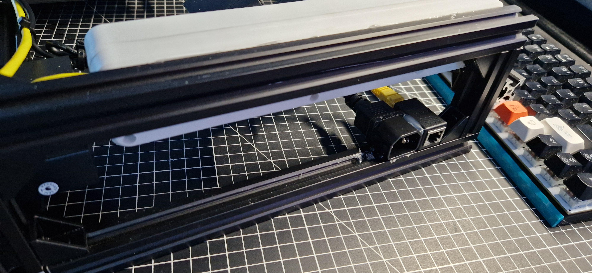
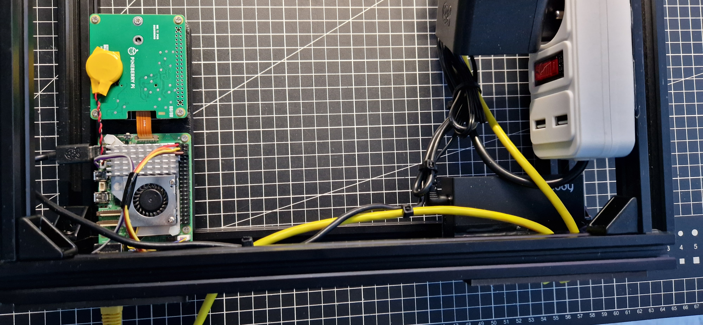
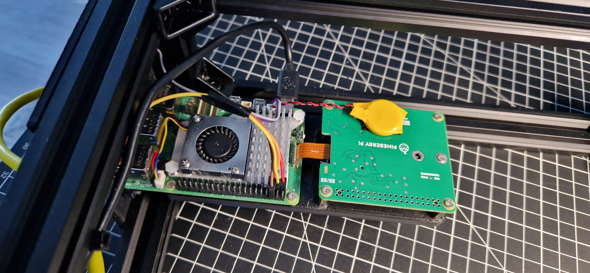
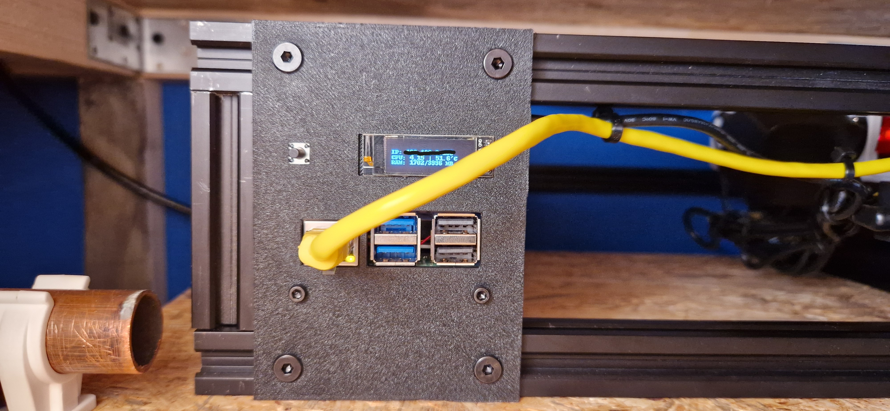

## Overview
This project has been made out of necessity, I needed a place to keep my GitLab server that I have been hosting till that moment on Obsium.mk2. My rack is not a typical rack nor a mini-rack, individual `modules` are stacked horizontally, not vertically bc I had a very limited space with a very limited height. The frame of my rack has been made out of leftover 20x20 v-slot extrusion, this allows me for a very easy installation of `nodes`. At the moment I have only two of this`nodes` (an ethernet switch module and a GitLab module). Later I plan to add a PiVPN to be able to connect to my server remotely.

## Features
My Pi-Rack main features are:
- Built using V-slots to allow for an easy assembly and expandability
- One-wire (technically speaking two) design. Connect it with one wire to mains voltage and with another one to ethernet. That’s all!
- Technically speaking, portable :upside_down_face:

## Hardware Components
| Component | Description | Quantity | Notes |
|-----------|-------------|----------|-------|
| V-slot extrusion | The entire frame is made out of it | 2/3m should be enough for something this size | |
| T-nuts and other v-slot stuff | All of the things used to put together the frame | 30ish, you are gonna need some for mounting the nodes to the frame | |
| An ethernet switch | Bc you need networking | 1 | I’m using cudy GS105 5-port switch |
| Ethernet cables | self explanatory | Depends on how many nodes you have | |
| Power strip | So that you only have one cable for powering the server | 1 | |
| IEC cable extender | I have changed the wire on the power strip to have a connector for mains voltage | | BE EXTREMELY CAREFUL WHEN WORKING WITH AC VOLTAGE. I’m a certified electrician but if you don’t know what you’re doing. Don’t do it! |
| Raspberry Pi stuff per one server | This depends on what you need, but generally a raspberry pi, SSD/SD, power supply, etc. | 1 | |

## Software and Tools
- FreeCAD - used to design the frame and the individual `nodes`
- RJ45 tester and other tools to make ethernet work
- Hot Glue to mount everything :face_with_peeking_eye:

## Gallery

  
  
  
  
  
  
