
**Info!** This project is WORK IN PROGRESS! Even though my PicoCalc's custom back is made, the software is still being developed.


[PicoCalc by ClockworkPi](https://www.clockworkpi.com/picocalc) is an amazing kit. But for my needs it lacks a few things, like how am I supposed to make a custom handheld system without RTC? Impossible... Thankfully Clockwork shares all the files on [their github](https://github.com/clockworkpi/PicoCalc) so it's fairly easy to add custom boards. Another thing, have you seen its software? Don't get me wrong, [PicoMite](https://geoffg.net/picomite.html) is incredible, but why would you use BASIC in 2025? So I'm also making new software...    
But let's not get ahead of myself. Let's, for now, focus on hardware

## Things added - hardware
Alright, PicoCalc comes equipped with 320x320px 4-inch IPS screen, QWERTY backlit keyboard, speakers and 3.5mm audio jack and an SD card reader all powered by *Raspberry Pi Pico H* (yes, that's exactly what it's said on the website). And that's great, It's plenty enough for a good handheld, but for my needs it lacks:
- RTC
- Environmental sensors, this includes thermometer, hygrometer and a barometer
- IMUs, magnetometer and an accelometer-gyro combo to be exact
- Extension port for I2C devices
- High power LED (bc I can)
- WiFi and bluetooth, thankfully I can swap *Pico H* for *Pico 2W*
- And last bat not least, a place for the allen key that comes with the PicoCalc

So that's what I did, I added all of those to my PicoCalc, lucky it has A LOT of unused space inside.

## Case
But adding that stuff is one thing, another thing is mounting them inside. And that took me 2 tries. At first I used the awesome back replacement by n602 on Thingiverse (here is a link: [Replacement bottom part for PicoCalc on Thingiverse](https://www.thingiverse.com/thing:6998636)). And I have modified it heavily to fit all I wanted. Maybe without the LED and extension port, that idea came to my mind later. And I printed this case in my beloved turquoise PETG

  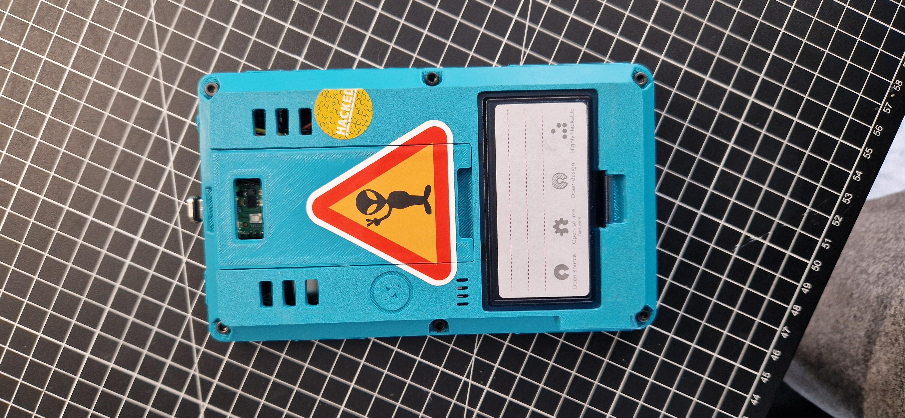
  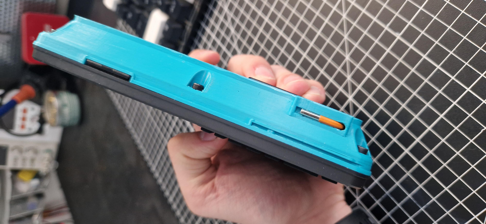
  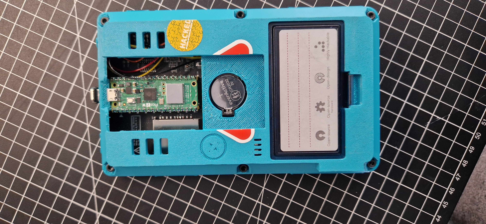


But a few weeks later I had a genius idea to add an extension port developed for my other project - [Otsi.mk2](/projects/otsi_mk2), high power LED as well as a mysterious port for something i will talk about in a minute. But at that point I wasn't totally sure if I wanted to change all of it. Soldering took a long time and I wanted to just program my PicoCalc. But after finding Kelpiscool's work on github I had to make it. Kelpiscool made an awesome modular back for PicoCalc that is much more flexible than n602's design (here you have a link: [PicoCalc modular back on Github](https://github.com/Kelpiscool/PicoCalc-modular-back)). So I have spent a lot of time designing the new Back and finally here it is. Printed in beautiful bottle green and mat black. TBH I think it looks better than the turquoise one.

  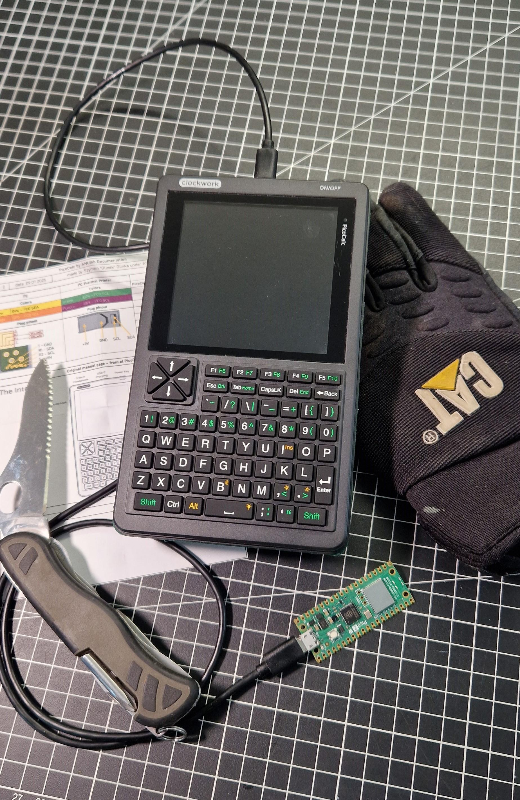
  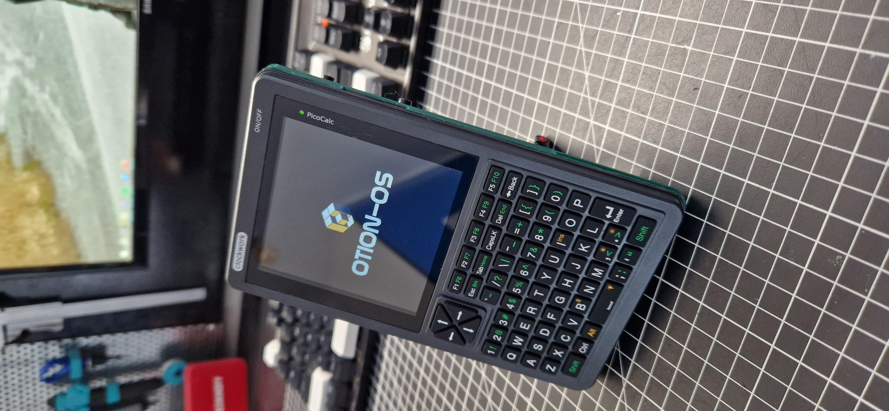
  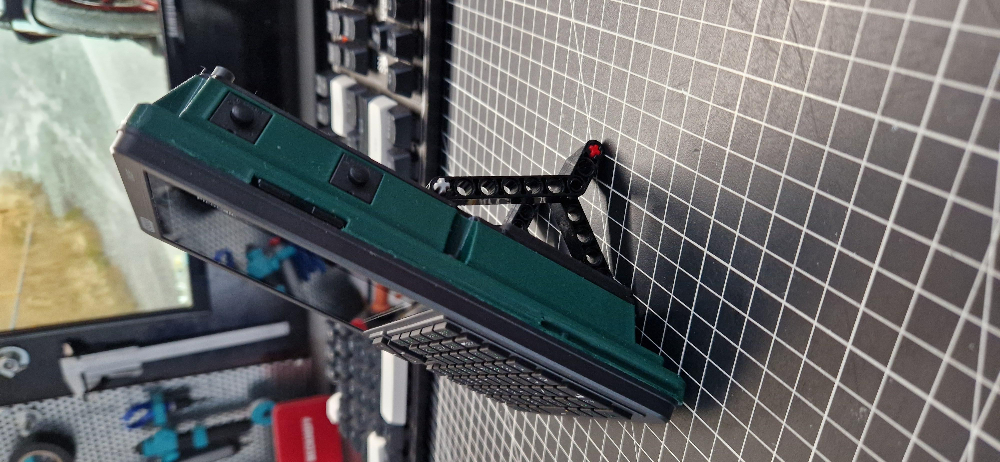
  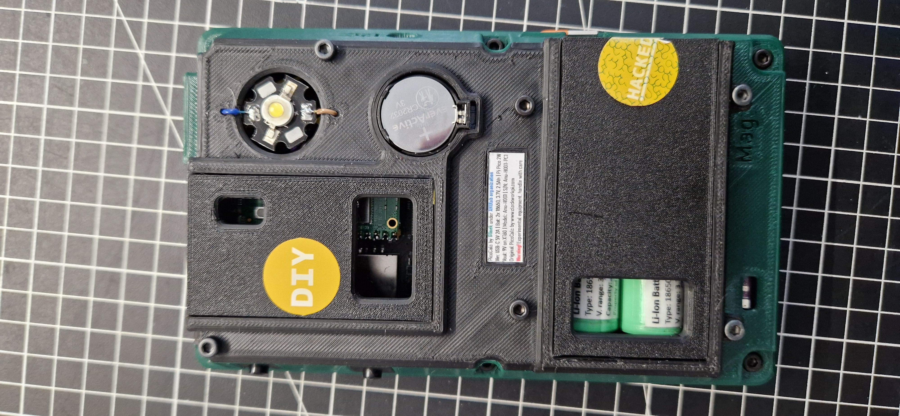
  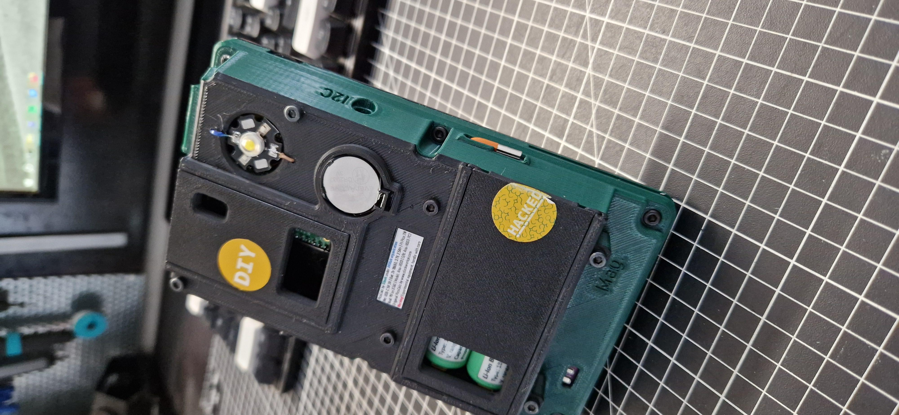
  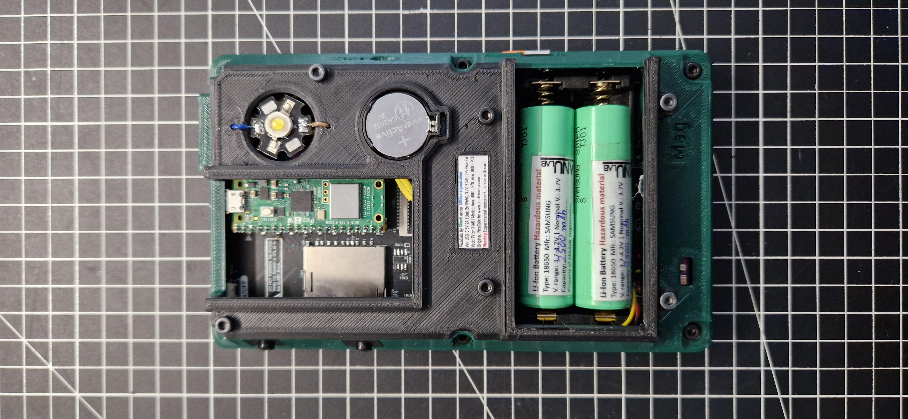
  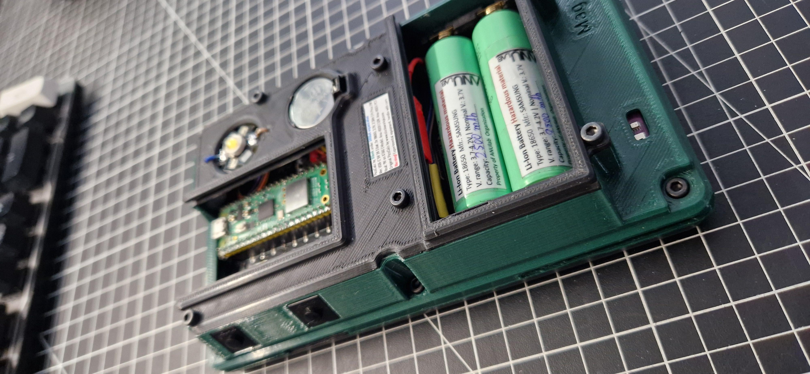


I also thought that it would be nice to show the comparison between the original back by ClockworkPi and my 2 attempts so here you have it:
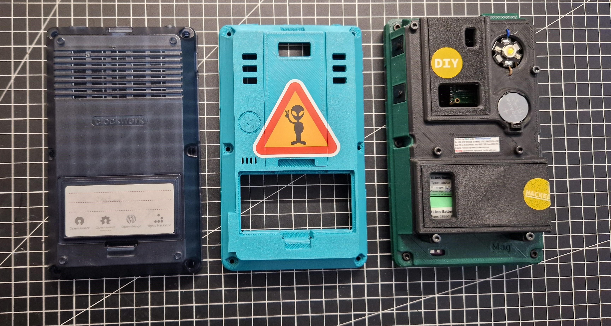
Original on the left, my first attempt in the center and my current version on the right.

## Software
The software is something special. Bc of PicoCalc being basically a glorified Raspberry Pi Pico I have been programming it in Arduino IDE (bc it's better than micropython...). My main goals for PicoCalc OS (named Otion-OS) are:
- Display data from all the sensors in a convenient way
- Have a notepad
- Have google calendar and weather forecast integrated
- Can't forget about the calculator, this includes:
    - Regular calculator
    - Scientific calculator
    - Trigonometry calculator + pitagoras triangle calculator (I use it a lot)
    - Proportion calculator (Also using it a lot)
    - Unit conversion
    - Wire thickness calculator
- Additionally everything that the I2C module outputs
- And something special, remember that mysterious port from earlier? That is for thermal printer, so my PicoCalc is going to be a printer as well.    

And those are my plans, as of today (10.07.2025) I have made the main menu and will now proceed into making widgets (google calendar and weather forecast, those to blank rectangles). Below you have a few photos showing current progress:

  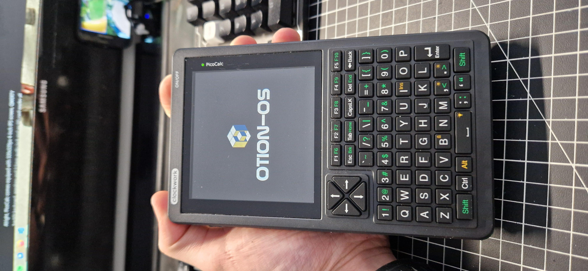
  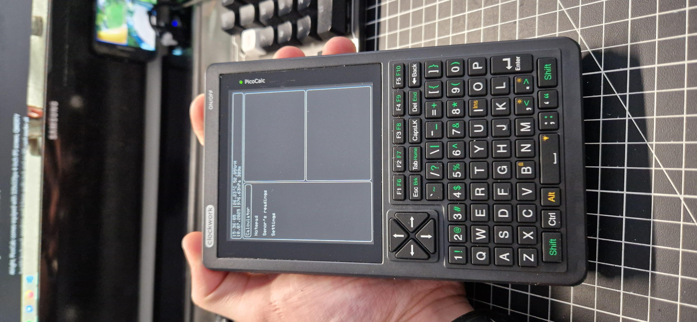


## Last words
As of today I'm not sharing any files for my mods for PicoCalc, mainly bc I don't have the time to work on all instructions and bc it uses a lot of other peoples projects and dealing with the licenses would be a nightmare. Hope you understand! But if you want some advice or maybe even some files don't hesitate to massage me! And for now here are some photos of soldering process:

  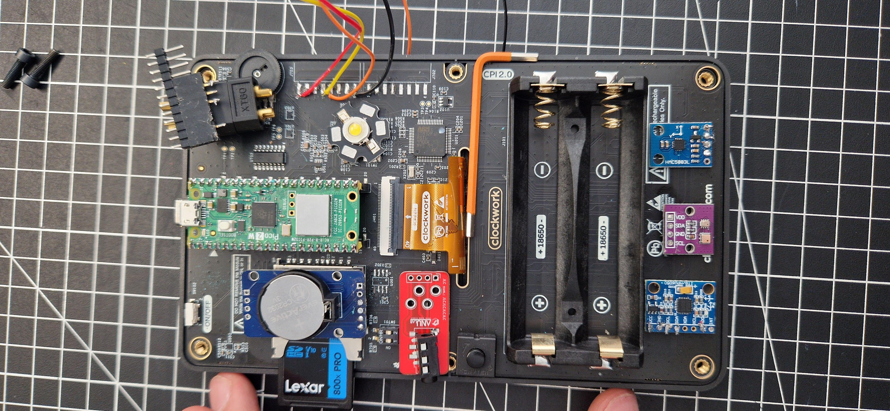
  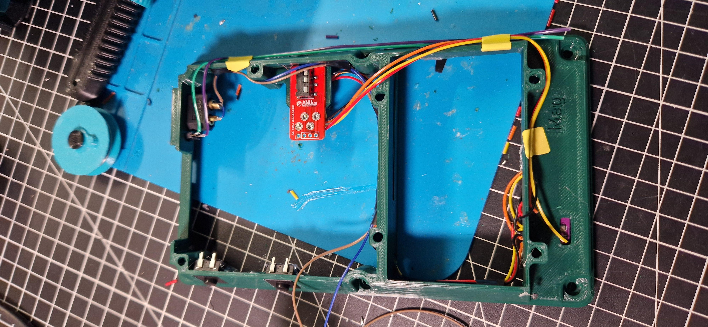
  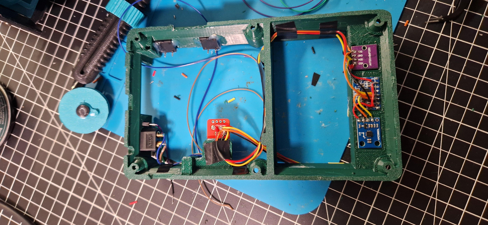


That's all, thank you soooo much for reading all of this. Hope to see you again!    
**Keep dreaming and stay persistent**    
**~Simon**

