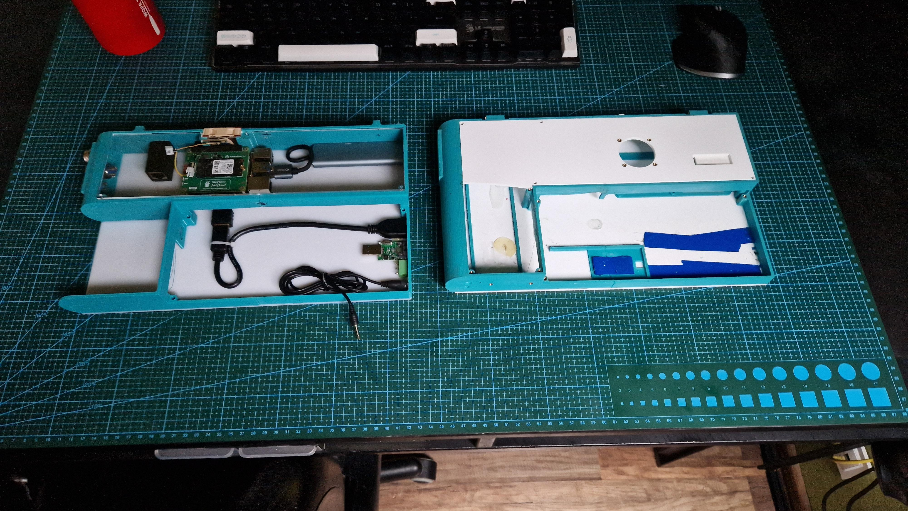
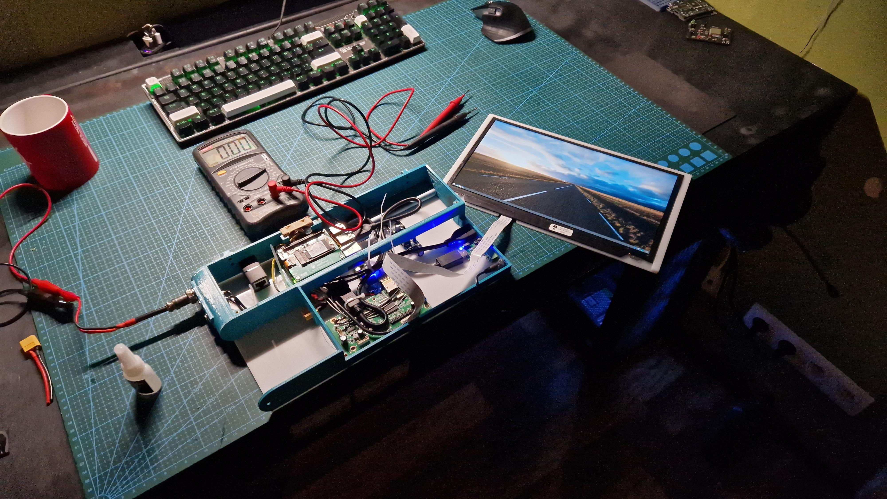
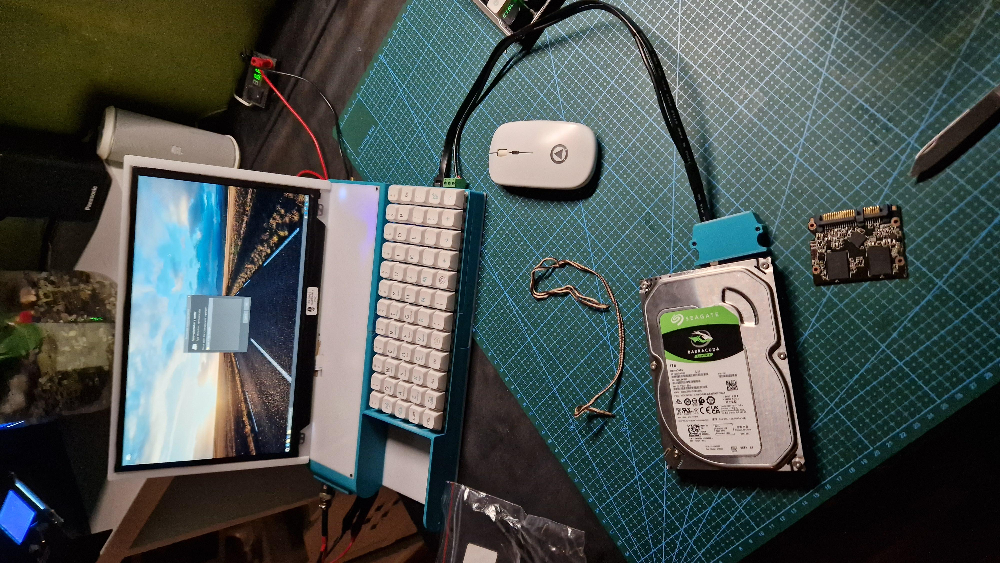
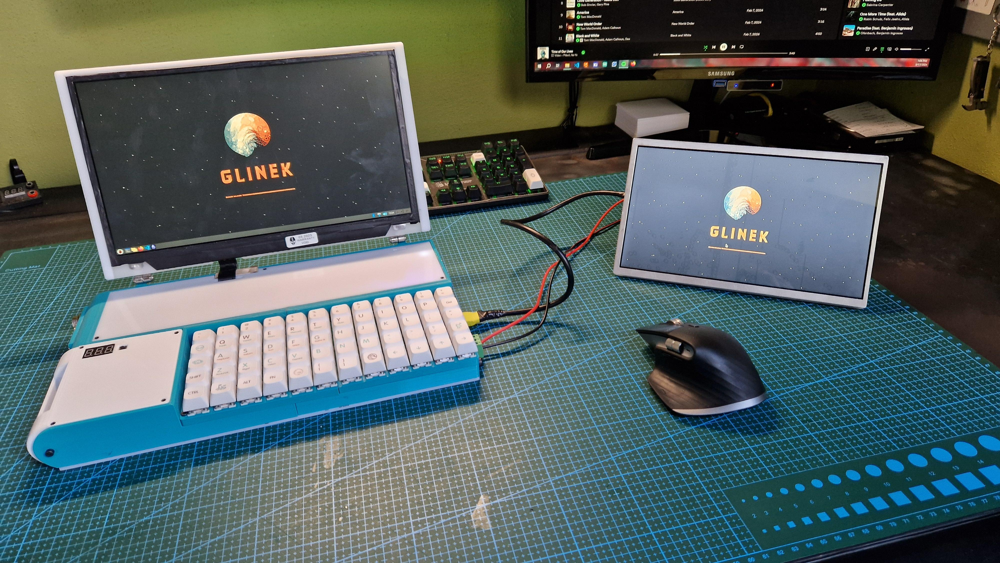
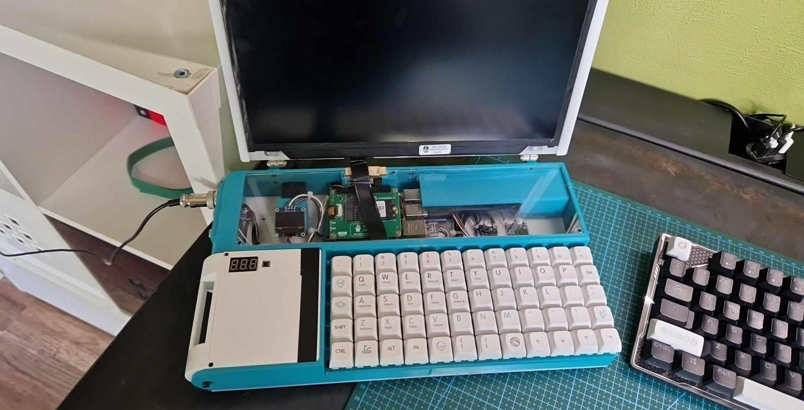
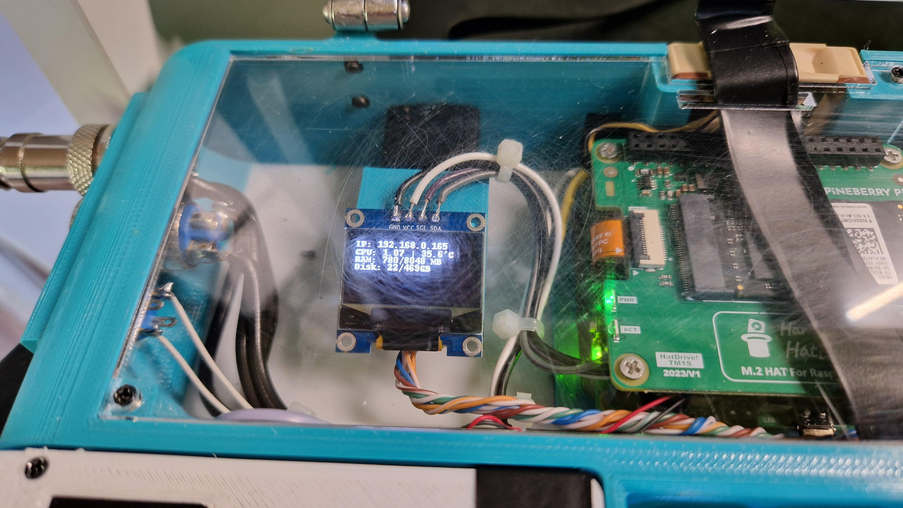

## Story
Obsium mk2 was a little spontaneous. It was never meant to even exist, but two factors changed my mind: the new Raspberry Pi and the fact that the first Obsium just stopped working. So I ordered Pi5 and waited almost 3 months. It's wild how long It took... Anyways, while my Pi was being shipped, I ordered M2 hat for it and started work on the design. At first the plan was to use an old case and just modify It, but I ended up creating a whole new case with some tweaks.
 *new (left) and old (right) case comparison*

## Obsium
### Specs
Obsium mk2 is powered by 8GB version of Raspberry Pi 5 with 512GB Samsung SSD and a 12ish inch Full HD screen.

### Battery
Battery is a huge improvement. Mk2 has a replaceable battery and every battery module has It's own 4S bms and 4x2000mAh Li-Ion cells. That gives about 2.5h of work time on a single battery pack.

### Keyboard
Keyboard is the same one as on mk1. It's a custom ortholinear keyboard with brown cherry switches.

### I/Os
Obsium has rather specific I/O, apart from the obvious ethernet, usb and audio jack, mk2 has an external port for connecting different antennas to built-in SDR. It also has external SATA and a port for powering disk's. With the custom cable connecting HDD drives is no problem.

### What has changed
Many things have changed. Apart from mentioned battery and Pi, the new case is much more comfortable to use, the I/O is also a huge improvement compared to mk1. But what Obsium mk2 lacks compared to mk1 is the integrated LoRa. Last vast improvements are friction hinges. I can't express how much using Obsium has improved with those.

### Second monitor
Thanks to having an external 12V port I was able to make a second monitor that could be powered entirely by Obsium.

### Stats screen
About a month after finishing Obsium I decided to add a 64x128px OLED display to show me basic stats and the temperature.

## Can It replace a laptop?
No. Short answer is no. I have been daily driving Obsium for a while. Then I managed to buy a laptop and there are a few things that I have noticed. But before that, a little disclaimer. Comparing cyberdecks to laptops is kinda pointless bc laptops are always gonna be better. Anyway, what I have noticed is that having ARM instead of x86 is a problem. I am not saying that It's a huge issue. But It's a problem, especially for me now when I need to program PLC's and Codesys or TwinCat is only available for x86 windows. Another thing is size, when It sits on a desk or is in a big backpack the thickness is not a problem. But e.g. when I want to take a smaller backpack Obsium takes most of the space. Last thing are thermals. Pi5 has awful thermals and for extended usage at 100% I would be afraid that sth might burn. But apart from that It might be a great computer for somebody that wants to write something from time to time at school or just have the ability to watch a movie or scroll through the internet on a bigger screen and an actual desktop. It's also a great way to learn a lot about electronics, 3D design, linux and more.

## Last words
Both Obsiums were great projects and I have learned a ton. I definitely won't disassemble this Obsium, It has Its own place in my heart and I just love It too much. Yes, It's not super powerful. Yes, I have a laptop now. But Obsium remains one of my favorite projects.\
**Stay creative and make cyberdecks**\
**~Simon**

