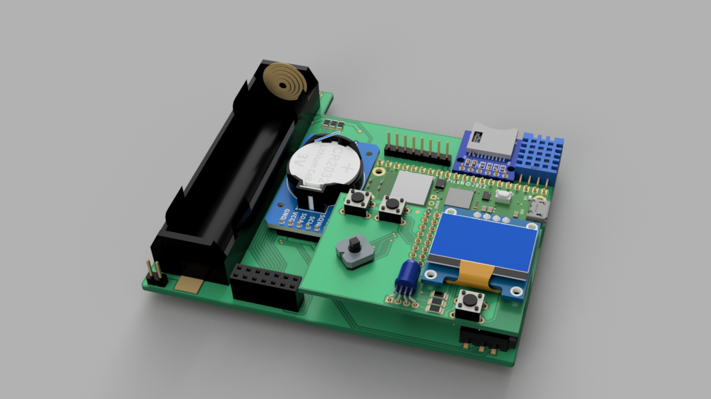


**Info!** Otsi.mk2 has been moved to ANUlab's website. Click [here](https://anulab.glinek.tech/projects/otsi.mk2/otsi-info/) to visit Otsi.mk2's new page.


Otsi is my passionate project that originated from [Cyberdeck Cafe's](https://cyberdeck.cafe/) contest for cyberpet and right now I am making an improved version with my friend that is going to have significant improvements over [Otsi.mk1](/projects/Otsi). As written above details about Otsi.mk2 have been moved to ANUlab's own website (link [here](https://anulab.glinek.tech/projects/otsi.mk2/otsi-info/).

### Some photos for you to enjoy :)

  
  
  
  


**Have a great day!**   
**~Simon**