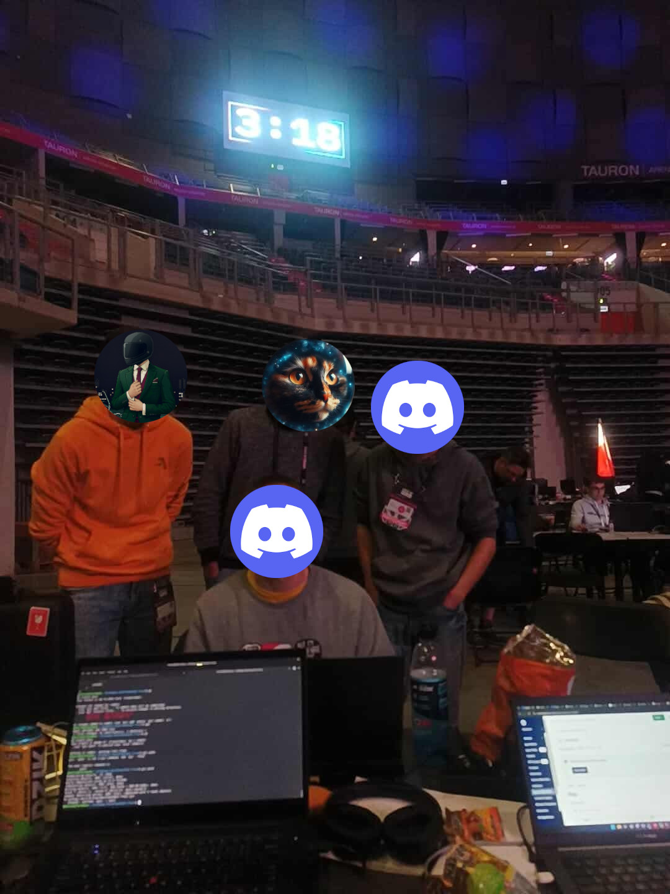
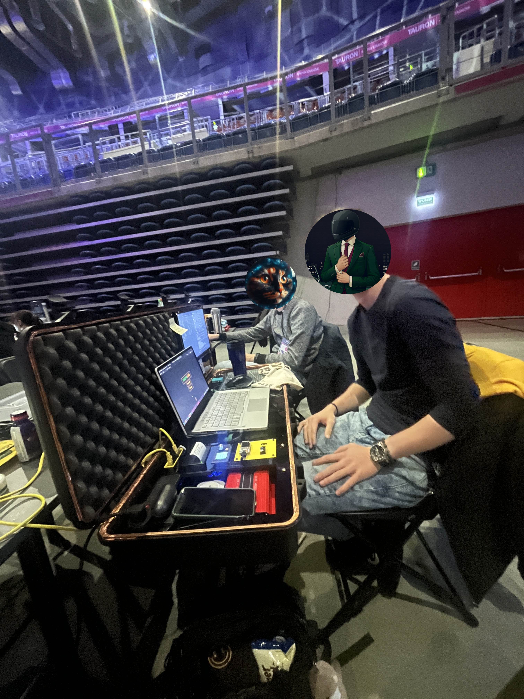



## My exerience at hackyeah
So It’s finally time that I talk about my experience at hackyeah 2025. It was a blast and I am very grateful that I could be there with my friends. Contrary to my previous hackyeah when I participated in a team of two and a half, this time participating in a team of six was AMAZING. And not only because we were able to do more but because it was a more fun experience. Seriously,  arguing with them over a stupid thing was hilarious and I enjoyed every part of it.

*Our photo, missing two people tho...*

## Our code
What we made was an app that is designed to help you with choosing your travel destination. It’s very tinder-like bc this mechanic is very underrated but great when it goes to UX and data you can get from it. The idea was that we would show a few places to get to know user preferences and then after that we would start displaying actual examples. The problem was classifying places and our solution was grouping locations based on their features like (proximity of a body of water, orientality of a places, average altitude, etc)

*Me while coding, an actuall test of Cition Portable*

## Funny story
Funny story, when we were uploading our code for scoring we saw that our app was given 3.4 / 5 but it was before the 24 had even passed. And at the end we got a score of 2.81… As it turns out hackathon is not only about coding but also about selling your idea. And we kinda suck at it… Better luck next time I guess XD. 