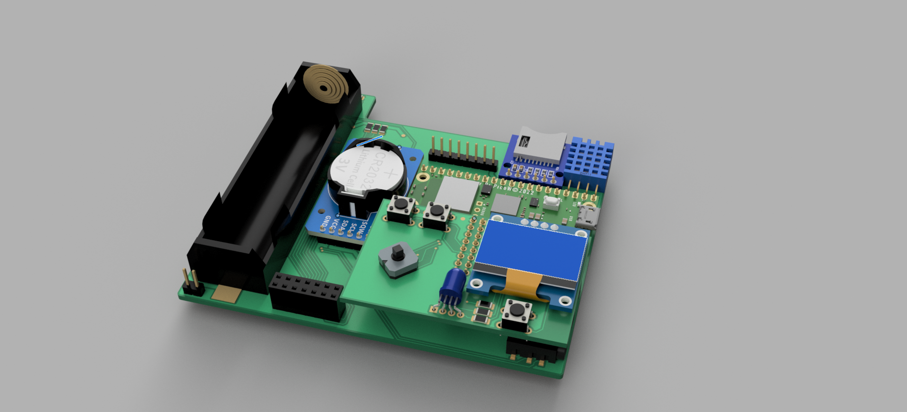
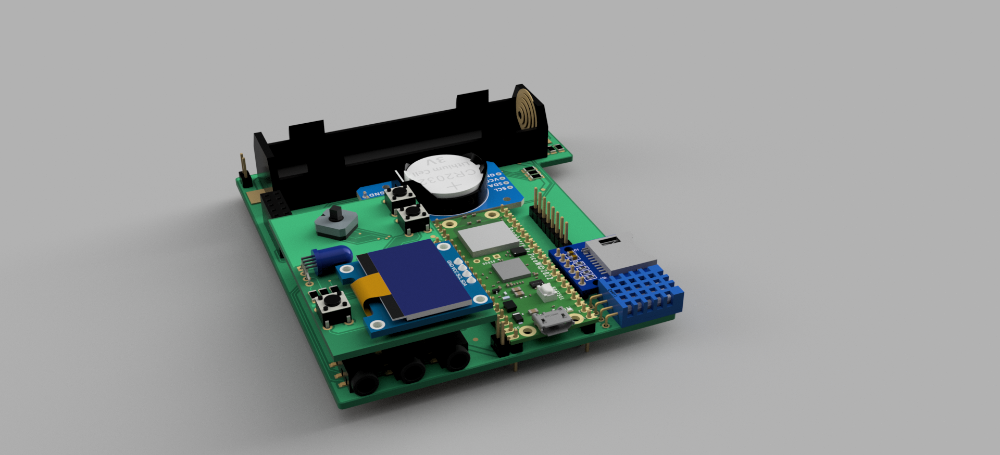


**Info** The second PCB hasn't been fully made so this project log isn't fully completed at this point
  
##
## Overall idea
This time the idea has changed drastically. First of all, now Otsi is composed of two PCBs.
- The first one being It's main PCB where battery is placed as well as Pico and all different ICs
- The second one being a UI PCB. That means that there are gonna be placed all the buttons, 0.96inch display and a RGB LED
Another change is that right now Otsi is no longer gonna be a handheld but rather a micro laptop of some sort with a lid-mounted main display. Other changes are:
- Different extension ports. This time there are 3x 4pin 3.5mm Audio Jacks that are gonna be connectors for I2C extensions
- Improved ergonomics
- different User Input. From now on Otsi is going to be based around a 5 position button with 3 additional ones.
- Change in the design process. What I mean by that is that this time I haven't design all the components, for example BMS and multimiter are left for development later.
And here are some of my early ideas of the second design

## 3D models
Also, this time I am doing proper 3D models of those PCBs. As of today (03 Apr. 2025) I have only designed a UI PCB but in the near future I'm going to continue the work on a model of main PCB.

And here are some early renders of Otsi's second revision of PCBs

### More to come when PCBs rev2 arrive

