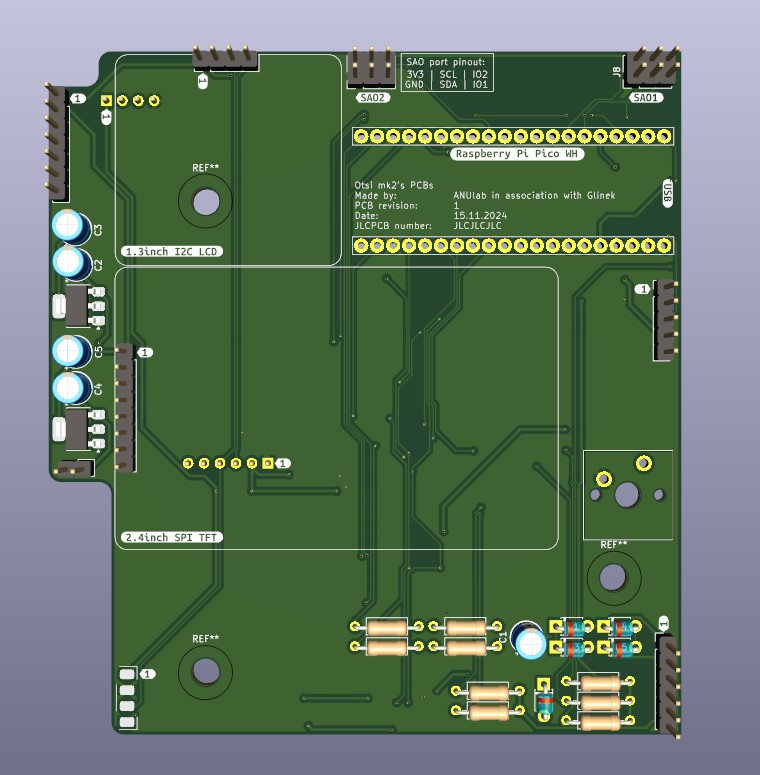
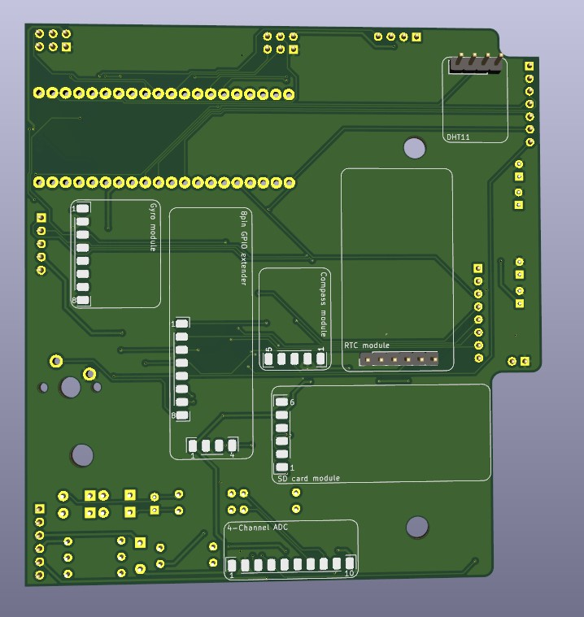
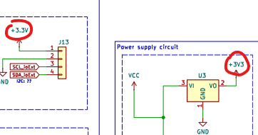

## Design
The first idea was to create something like a handheld so that one could use Otsi everywhere. But there are a few issues with this approach. First of all, it's getting pretty big pretty quickly and my goal was to make it as cheap to build as possible. That means fitting within JLCPCB's 100x100mm size for the cheapest PCB. And that's the first issue with this design. They didn't fit within those dimensions by like 5mm so 5 PCBs (with delivery and taxes) costed me almost 20 bucks. Enough of a back story, here is what I came up with

Being completely honest. I am proud of those PCBs bc beside the dimension issue they look good, and work... most of the times...

## First issue (check your schematics 4 times...)
Here you have my schematic for this PCB and let's play a little game. Look at it and try to figure out what is wrong with it, I mean, connection wise.

So in this version I placed two V regulators so that Pico with displays is powered from one and ICs from the other one. First voltage regulator is connected to +3V3 line and the second one to +3.3VP line...

But as you can see above, the regulator is connected to +3V3 line but everything else to +3.3V. And I didn't catch it earlier bc of using 2 voltage regulators, my Pico and displays had power so I completely forgot about the difference in voltage regulators. This one tiny mistake led me to buying an oscilloscope and investigating if the capacitance of I2C lines is correct... That being said, always remember to check your schematic and measure voltage at the beginning. And before my next problem, let's look at the assembled PCBs

## Semi-soldered PCBs
After receiving my package with my boards I made another mistake, I have soldered everything (or almost everything at once)

Soldering everything at once is a big problem bc you don't know what exactly is causing errors and have to desolder everything piece by piece. And second thing I should have done is using gold pins sockets for e.g. Pico instead of soldering it directly. It would have saved me a lot of trouble later.

## I2C addressing issues
Another thing to keep in mind is checking all of your I2C devices beforehand. I didn't do it bc I thought that it would take too much time, where, in fact, it would save some. My problem was that 2 of my devices had the same address and everything connected to the BUS after those devices were working only when you jumped on one leg around it and didn't breath near them for exactly 2.3s or saying it normally, they just were working randomly. And after I figured this out, there was one last problem.

## Never mess with config files for Arduino
I am using a [library](https://github.com/earlephilhower/arduino-pico) for programming Pico in Arduino IDE. And after a stroke of genius I have changed something in config files and bc of it none of my I2C devices were working properly. They just didn't communicate with Pico... I have spent 1 whole week debugging it every day... It was a pain...

## Last words
This project log is slowly coming to an end but I hope you learned that rushing stuff never helps and that your stupidity is your biggest enemy. See you in the next Otsi update.

**Stay creative and slow down**    
**~Otsi development team and Simon**

