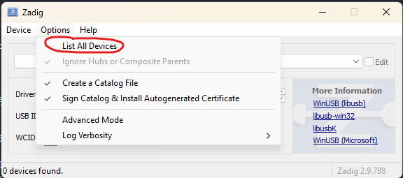
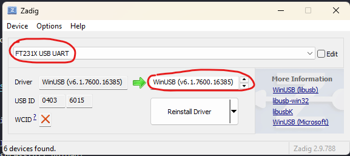
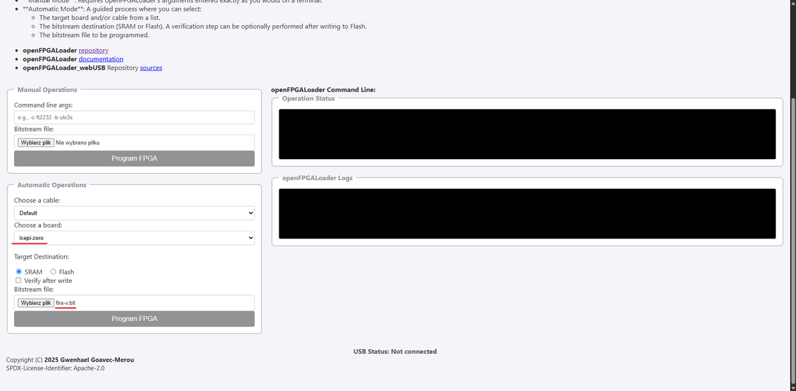
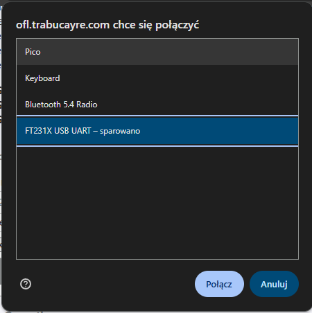
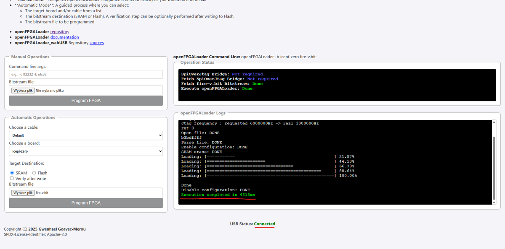
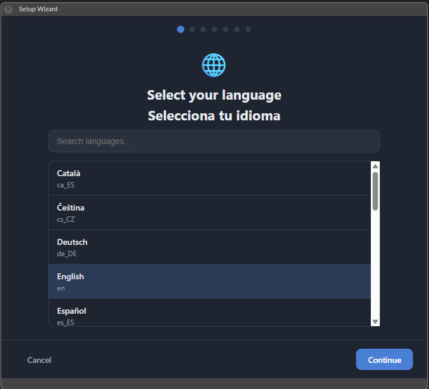
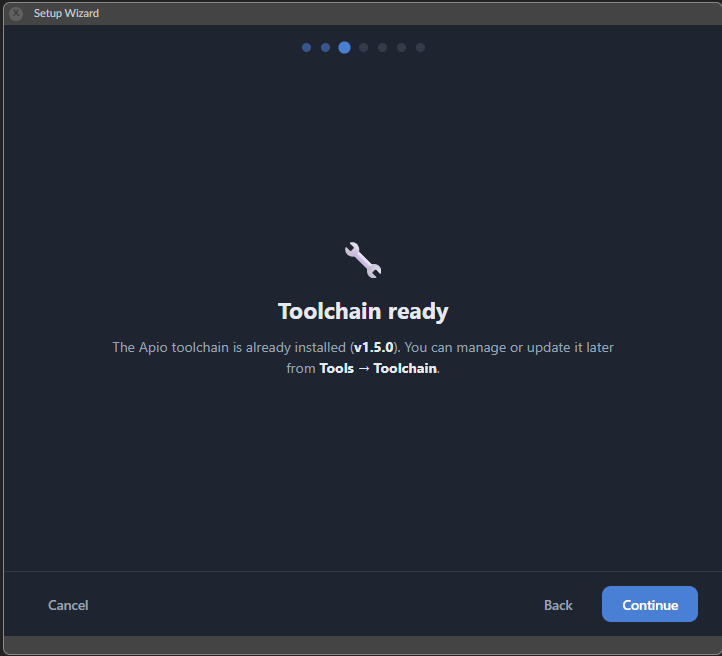
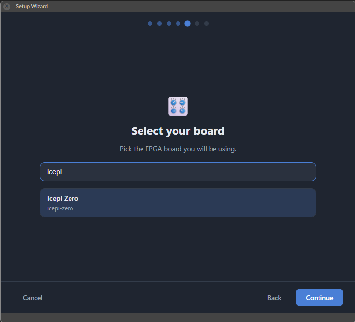
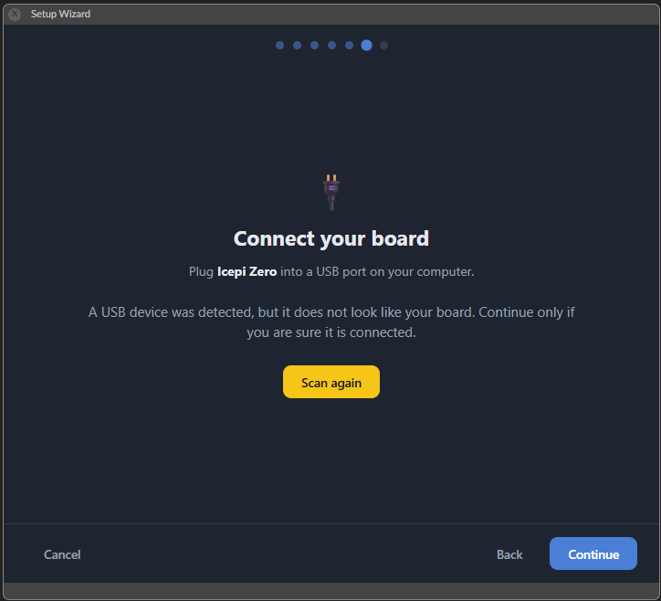
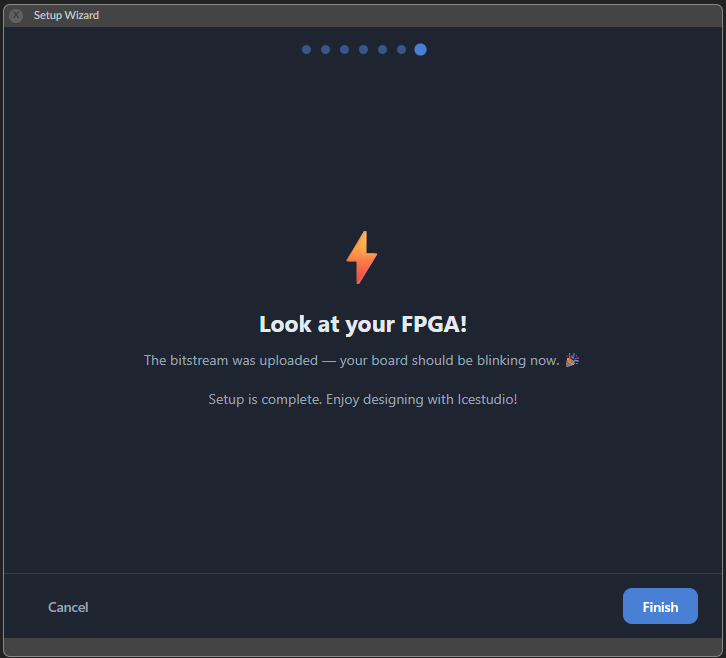

In this tutorial I will help you get your IcePi Zero setup and working on Windows!

## Uploading the test code to your IcePi
1. Preparation
- Download [this demo code](https://github.com/cheyao/icepi-zero/raw/refs/heads/main/documentation/fire-v.bit)
- Download [zadig](https://zadig.akeo.ie/)
- Open [this website](https://ofl.trabucayre.com/) use **CHROME!**
2. Open zadig, select IcePi zero (you might need to select `list all devices` in options) and replace driver with WinUSB

3. Unplug the board for a few seconds
4. Open the website, in automatic operations select IcePi Zero and the demo file fire-v.bit

5. Upload, If you have done everything right you should see information about successful upload!

## Programming IcePi Zero
There are multiple ways to program FPGA boards, especially ones like IcePi Zero. Some are more advanced than others and with this also comes the step-up in difficulty. If you are like me (new to FPGA and just want to play with it) you might want to try [IceStudio](https://icestudio.io/). Its main selling point is that it's easy for beginners to learn. So let's download it!
  
**Important** As of writing this tutorial (02.07.2026). I was able to program IcePi using the nightly build of IceStudio. You want to be using at least version 1.0, which is, right now, a nightly build. Be aware that Windows Defender might flag it as a virus. After some investigation I came to the conclusion that It might be a false alarm but be aware and proceed at your own risk!
  
When you download IceStudio v1.0 or higher It's pretty straight forward from there. Just follow the installation guide (screenshots below :) ) and upload a test code. Icestudio might not recognize the board at first but It should upload without a problem and you should see your board blinking.

  
If you want to print the same case as on this blog's picture you can download it [here](https://github.com/Glinek/IcePiZero-case)  
Thank you for reading! I hope I helped a little :)  
~Simon

